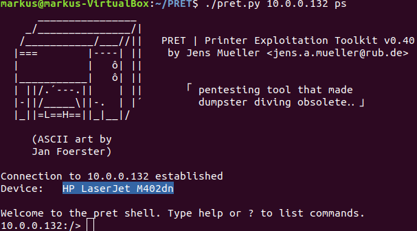

# CheckResearch.org [Experiment](https://checkresearch.org/Experiment/View/139d4225-319a-4655-86d7-9b2a8f71c85b)

 Publication ["SoK: Exploiting Network Printers."](https://dblp.uni-trier.de/rec/html/conf/sp/MullerMSS17) by "Jens Müller 0007, Vladislav Mladenov, Juraj Somorovsky, Jörg Schwenk"

## Experiment Setup

### Experiment Content

The experiment aimed to reproduce the results of the paper using a smaller variety of printers. Since it has been conducted in a private environment only the two printers listed under [Hardware](hardware) have been used.

### Hardware/Software

#### Hardware:
The whole experiment has been conducted in a Virtual Machine with the following Hardware specifications:
* 2 Processor cores of a Intel Core i7-4820K
* 8 Gb of Memory
* Ethernet connection via NAT over Intel PRO/1000MT Desktop

Printers:
* HP LaserJet M402dn
* HP Color LaserJet Pro MFP M277dw
#### Software:
* Ubuntu 18.04
* [PRET - Printer Exploitation Toolkit](https://github.com/RUB-NDS/PRET)
## Preconditions
PRET consists of python scripts which means that the only thing needed to run the toolkit is a Python2 interpreter. If you want to have a colored output and SNMP support you need to install the pip modules colorama and pysnmp by running the command:

    # pip install colorama pysnmp

After cloning the repository from [GitHub](https://github.com/RUB-NDS/PRET) you can run the toolkit via:

    ./pret.py
    
This displays an overview of all printers the toolkit has been able to discover on the network. Detailed information on how to use the toolkit can be found in the README of their [GitHub](https://github.com/RUB-NDS/PRET) repository.

## Experiment Steps
The toolkit can be run by executing:

    ./pret.py

 This should display an overview of all printers the toolkit has been able to discover on the network but for some reason when executing it inside the virtual machine it did not find any printer even though Ubuntu was able to discover the printers on the local network.

It did however work to connect to a printer by running:

    ./pret.py 10.0.0.132 ps

This shell now allows to use a predefined set of commands to attack the printer. The PRET toolkit translates each command into a set of instructions using the language that has been defined upon opening the toolkit (PS, PJL or PCL). For a full list of available commands you can execute the following command inside the PRET shell:

    10.0.0.132:/> help

## Results
Even though the two tested printers have been produced in different years and differ in their functions, they both were vulnerable to the same kinds of attacks.

The following table outlines which attacks worked using which printer programming language (PS, PJL, PCL): 
            
| Command                   | PS            | PJL   | PCL |
| --------------------------|---------------|-------|-----| 
| restart                   |      ✘        |   ✔  |  ✔ | 
| capture (with disconnect) |      ✘        |   ✘  |  ✘ |
| capture (connected)       |      ✔        |   ✔  |  ✔ |
| cross                     |      ✔        |   ✘  |  ✘ |
| replace                   |      ✔        |   ✔  |  ✔ |
| selftest                  |      ✘        |   ✔  |  ✘ |

There are many commands available for interacting with the printers file system. Because they all worked as expected they will not be listed individually. These commands can be used to tamper with files on the printer, gain information on what is being stored there and even copy malicious files onto the printers file system.

Both printers tested were vulnerable to the following kinds of attacks using the following printer programming language: 

| Attack                            | Language |
|-----------------------------------|----------|
| Denial of Service (infinite loop) |    PS    |
| Factory Reset                     |    PJL   |
| Content Overlay                   |    PS    |
| Content Replacement               |    PS    |
| Print Job Capture                 |    PS    |

The print job capture only worked when the PRET Toolkit stayed connected to the printer. Starting the capture and returning later to list the captured jobs did not work.

The only attack that has not been tested on the two printers was to inflict physical damage to the printers. This command could not be tested because the only printers available for the experiment were private property and not designed to be destroyed.

Over all every attack described in the paper  ["SoK: Exploiting Network Printers"](https://dblp.uni-trier.de/rec/html/conf/sp/MullerMSS17) worked as expected and the results of the researchers were reproducible. 
